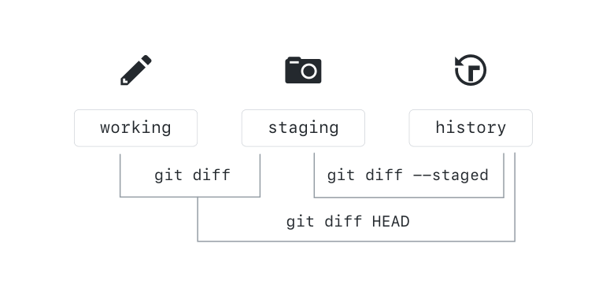

## Viewing Local Changes

Now that you have some files in the staging area and the working directory, let's explore how you can compare different points in your repository.

### Comparing Changes within the Repository

`git diff` allows you to see allows you to see the difference between any two refs in the repository. The diagram below shows how you can compare the content of your working area, staging, and HEAD (or the most recent commit):



Let's try these commands on the repository:

```sh
$ git diff
$ git diff --staged
$ git diff HEAD
$ git diff --color-words
```

`git diff` will also allow you to compare between branches, commits, and tags by simply typing:

```sh
$ git diff <REF-1> <REF-2>
$ git diff gh-pages slow-down
$ git diff origin/gh-pages gh-pages
$ git diff 2710 b745
```

> Notice that, just like merges, diffs are directional. It is easiest to think of it as "diff back to <REF-1> starting at <REF-2>" or "see what is *not* in <REF-1> but *is* in <REF-2>".

#### Alias Pro Tip

**Returning to the Remote**

After finishing up locally, you might determine that you want to head back to your remote repository to make sure that everything looks right.

**Note:** Depending on your shell, you might have to add these aliases directly to your git config file, which you can open by typing `git config --global -e`.

WINDOWS
```
git config --global alias.open = "!f() { REPO_URL=$(git config remote.origin.url); explorer ${REPO_URL%%.git}; }; f"
```

MAC/LINUX
```
git config --global alias.open = "!f() { REPO_URL=$(git open remote.origin.url); explorer ${REPO_URL%%.git}; }; f"
```

And just in case you're prone to forget your word choices, you can link multiple aliases together to accomplish the same purpose.

```
git config --global alias.browse "!git open"
```


*Source: these [three](http://haacked.com/archive/2014/07/28/github-flow-aliases/) / [blog](http://haacked.com/archive/2015/06/29/git-migrate/) /  [posts](http://haacked.com/archive/2017/01/04/git-alias-open-url/) by GitHubber Phil Haack.*
