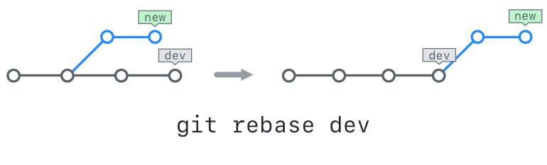

## Merge Strategies: Rebase

In this section, we will discuss another popular merge strategy, rebasing.

### Understanding Git Merge Strategies

Git uses three primary merge strategies:

#### Fast Forward
A fast forward merge assumes that no changes have been made on the base branch since the feature branch was created. This means that the branch pointer for base can simply be "fast forwarded" to point to the same commit as the feature branch.
#### Recursive
A recursive merge means that changes have been made on both the base branch and the feature branch and git needs to recursively combine them. With a recursive merge, a new "merge commit" is made to mark the point in time when the two branches came together. This merge commit is special because it has more than one parent.
#### Octopus
A merge of 3 or more branches is an octopus merge. This will also create a merge commit with multiple parents.


### About Git Rebase

`git rebase` enables you to modify your commit history in a variety of ways. For example, you can use it to reorder commits, edit them, squash multiple commits into one, and much more.

To enable all of this, `rebase` comes in several forms. For today's class, we'll be using interactive rebase: `git rebase --interactive`, or `git rebase -i` for short.

Typically, you would use `git rebase -i` to:

- Replay one branch on top of another branch
- Edit previous commit messages
- Combine multiple commits into one
- Delete or revert commits that are no longer necessary

### Creating a Linear History

One of the most common uses of rebase is to eliminate recursive merges and create a more linear history. In this activity, we will learn how it is done.



#### Set Up
1. Find the SHA of the initial commit: `git log --oneline`
1. Reset to the SHA of the initial commit: `git reset --hard SHA`
1. Create a new branch and check out to it: `git checkout -b rebase-me`
1. Cherry-pick files 4-6 onto the `rebase-me` branch using the reflog.
1. Checkout to master: `git checkout master`
1. Cherry-pick files 1-3 onto the `rebase-me` branch using the reflog.
1. Look at your history: `git log --oneline --graph --decorate --all`
1. If you merged now, it would be a recursive merge.

#### Begin the Rebase
1. Checkout to the `rebase-me` branch: `git checkout rebase-me`
1. Start the merge: `git rebase -i master`
1. Your text editor will open, allowing you to see the commits to be rebased.
1. Save and close the `rebase-todo`.
1. Watch your rebase happen on the command line.
1. Take another look at your history: `git log --oneline --graph --decorate --all`
1. If you merged now, it would be a fast-forward merge.

#### Finish the Merge
1. Checkout to master, the branch you will merge into: `git checkout master`
1. Merge your changes in to master: `git merge rebase-me`

#### Alias Pro Tips

**Getting Your Working Directory Up to Date**
```
git pull --rebase --prune
```
is a helpful command that allows you to pull changes down from the remote and place local commits to follow the remote updates.

If you'd like to combine this with another advanced workflow tip and update your submodules, that command might look like this:
```sh
git config --global alias.up "!git pull --rebase --prune $@ && git submodule update --init --recursive"
```
- Using the ! prefix allows you to use any command and not just git commands in the alias. It also allows you to string two commands together.

*Source: these [three](http://haacked.com/archive/2014/07/28/github-flow-aliases/) / [blog](http://haacked.com/archive/2015/06/29/git-migrate/) /  [posts](http://haacked.com/archive/2017/01/04/git-alias-open-url/) by GitHubber Phil Haack.*
