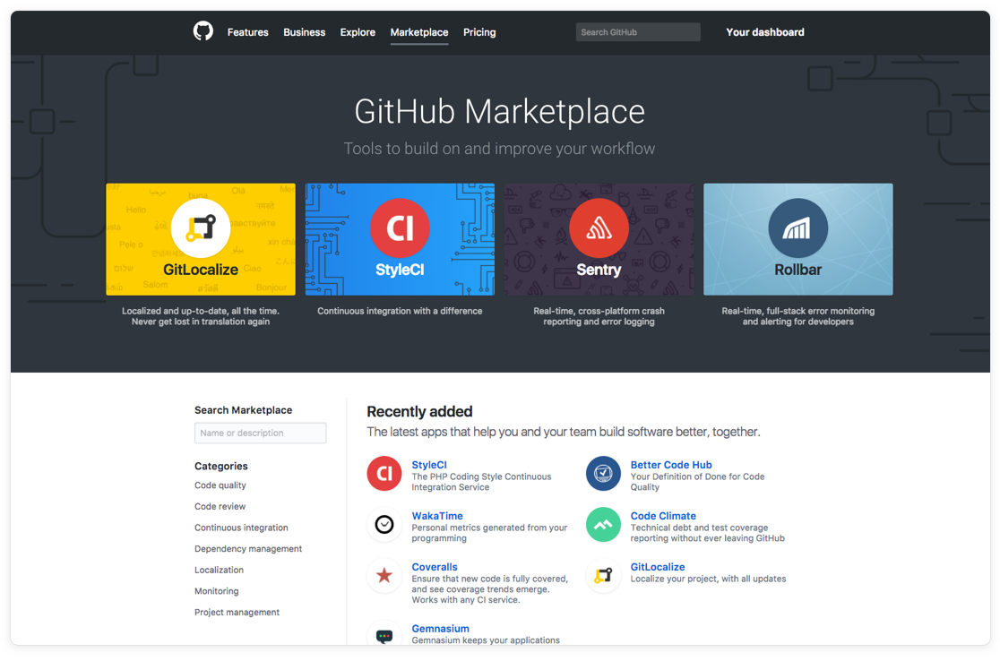

## The Modern Software Organization

Software has become a critical component of every business. Software is embedded in the product, responsible for tasks like running the machines that make the product, managing logistics, or actually _being_ the product. Reliability and shortened release cycles are a competitive advantage in a quickly changing technological environment.

Successful development teams have had to change their paradigms for how they work over time. The complexity of software is increasing, and teams are more reliant on one another to solve problems and evaluate potential solutions.  Evolving organizational structures and international geography are making it more difficult to get the right people in the room. And, Open Source is changing how we think about IP.

Whether you're aware of it or not, source code management impacts your business. How you protect your source code matters. Does it facilitate collaborative workflows, or does it make it harder for developers to work? You have an opportunity and an responsibility to provide assurances of code quality and speed up release cycles, all of which is tightly related to your source code.

### The GitHub Ecosystem

Rather than force you into a "one size fits all" ecosystem, GitHub strives to be a place of reliability and discovery, bringing all of your favorite tools together alongside exciting new prospects. For more information on integrations, check out https://github.com/integrations. Find even more tools at https://github.com/works-with.

