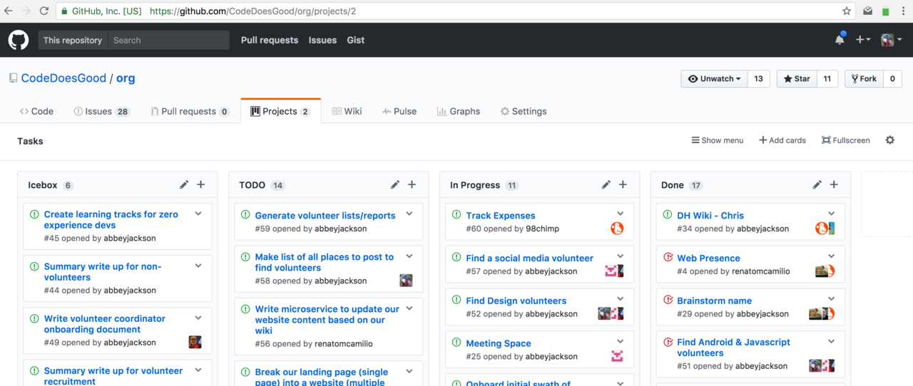

## GitHub Project Boards

Project boards are Kanban style organization tools.

Project boards are one tool, but you could also use many other options to fill this project management role.

1. Navigate to the repository's **Project** tab.
1. Add your issue as a card to the "In Progress" column.

We will come back to the project board throughout the process to track our changes.
