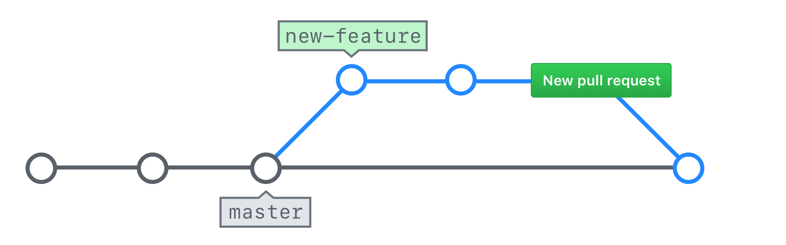

## Merging Pull Requests

Now that you have made the requested changes, your pull request should be ready to merge.

### Merge Explained

When you merge your branch, you are taking the content and history from your feature branch and adding it to the content and history of the `gh-pages` branch.

Many project teams have established rules about who should merge a pull request.

- Some say it should be the person who created the pull request since they will be the ones to deal with any issues resulting from the merge.
- Others say it should be a single person within the project team to ensure consistency.
- Still others say it can be anyone other than the person who created the pull request to ensure at least one review has taken place.

This is a discussion you should have with the other members of your team.

### Merging Your Pull Request

Let's take a look at how you can merge the pull request.

1. Navigate to your Pull Request (HINT: Use the Author or Assignee drop downs to find your Pull Request quickly)
1. Click *Conversation*
1. Scroll to the bottom of the Pull Request and click the *Merge pull request* button
1. Click *Confirm merge*
1. Click *Delete branch*
1. Click *Issues* and confirm your original issue has been closed

> GitHub offers three different merge strategies for Pull Requests:
- **Create a merge commit:** This is the traditional option that will perform a standard recursive merge. A new commit will be added that shows the point when the two branches were merged together.
- **Squash and merge:** This option will take all of the commits on your branch and compress them into a single commit. The commit messages will be preserved in the extended commit message for the commit, but the individual commits will be lost.
- **Rebase and merge:** This option will take all of the commits and replay them as if they just happened. This allows GitHub to perform a fast forward merge (and avoids the addition of the merge commit).
