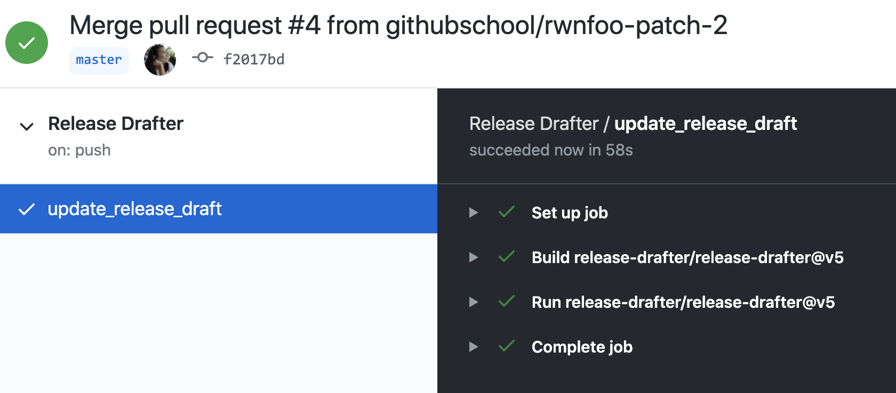

### Activity: Use GitHub Actions to Automate Releases

#### Add an Action to your repository from the Marketplace


1. For this activity, we are going to use the [Release Drafter](https://github.com/marketplace/actions/release-drafter) action from the Marketplace. This Action helps you organize and draft your release notes. Here, you can read through the documentation and understand how you can customize it to your own liking.
1. Some Actions use a configuration file and `Release Drafter` is one of them. Go ahead and create a configuration file in your repository in the following directory: `.github/release-drafter.yml`
1. In this file, add the following:

   ```yml
   name-template: 'v$RESOLVED_VERSION 🌈'
   tag-template: 'v$RESOLVED_VERSION'
   categories:
     - title: '🚀 Features'
       labels:
         - 'feature'
         - 'enhancement'
     - title: '🐛 Bug Fixes'
       labels:
         - 'fix'
         - 'bugfix'
         - 'bug'
     - title: '🧰 Maintenance'
       label: 'chore'
   change-template: '- $TITLE @$AUTHOR (#$NUMBER)'
   version-resolver:
     major:
       labels:
         - 'major'
     minor:
       labels:
         - 'minor'
     patch:
       labels:
         - 'patch'
     default: patch
   template: |
     ## Changes

     $CHANGES
   ```

   This configuration file styles and formats your release notes.

1. Next, add your workflow file to the following directory: `.github/workflows/release-drafter.yml`
1. In this file, paste the following:

   ```yml
   name: Release Drafter

   on:
     push:
       # branches to consider in the event; optional, defaults to all
       branches:
         - main

   jobs:
     update_release_draft:
       runs-on: ubuntu-latest
       steps:
         # Drafts your next Release notes as Pull Requests are merged into ${{ branches }} from above.
         - uses: release-drafter/release-drafter@v5
           with:
           # Specify config name to use, relative to .github/.
             config-name: release-drafter.yml
           env:
             GITHUB_TOKEN: ${{ secrets.GITHUB_TOKEN }}
   ```

   Let's break down what this workflow file means:
   - `on: push:` - This is the event trigger for this workflow. In this example, we are triggering this workflow whenever there is a push on `main` branch.
   - `jobs` - Jobs define the environment and the steps.
   - `uses` - This is where you define the Action. In this example, we are specifying version 5 of the `release-drafter` repo.
   - `config-name` - Here, we call out the configuration file we added previously.
   - `GITHUB_TOKEN` - This action utilizes your Personal Access Token which is stored in the Actions Secret store.

> NOTE: Before triggering the action, ensure you already have an existing release in your repository.

#### Trigger the Action

1. Let's add a Release before we introduce new changes, we can name this Release `v0.0.1`.
1. Since the **Configuration file** contains `chore` as a label in your releases, let's go ahead and add a label called `chore`.
    - Under the `Issue` or `Pull Request` tab, click `New Label` to create a new label.
1. Create a new branch named, `new-colors`
1. While on the `new-colors` branch, edit the `index.html` file
1. Modify the code on lines 116 through 122 by replacing the existing colors with new colors. For example:

   ```git
   - var i = { size: 4, blocks: [0x0F00, 0x2222, 0x00F0, 0x4444], color: 'purple' };
   + var i = { size: 4, blocks: [0x0F00, 0x2222, 0x00F0, 0x4444], color: 'blue' };
   ```

1. Create a commit and open a Pull Request
1. In your Pull Request, add a label defined in the Configuration file:
    - `enhancement`
    - `bug`
    - `chore`
1. Merge your Pull Request
1. Check on your Actions by clicking the **Actions** tab

   

#### Congratulations 🎉

Head over to **Releases** and marvel at the outcome:


#### Keep on practicing

- Edit the Configuration file to your liking and run your Action again
- Try out other Actions in the [Marketplace](https://github.com/marketplace?type=actions)
- Learn more about Actions via the [GitHub Learning Lab](https://lab.github.com/search?q=actions)
