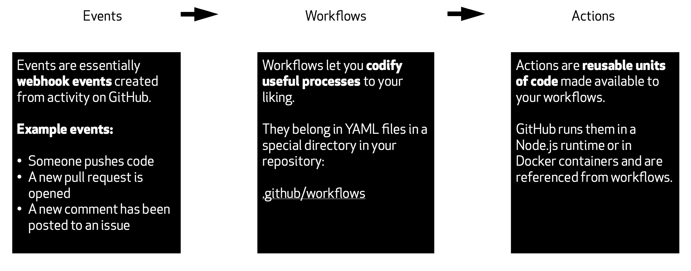

##  GitHub Actions

Actions are sharable individual tasks that perform units of work; they allow you to automate and execute your software development workflows right in your repository.

**Example use cases of GitHub Actions:**

- Build a container and deploy a web service
- Automatically merge an approved pull request
- Welcome new users to your repository during onboarding
- Run unit tests against pull requests

**Actions can be defined in multiple places:**

- Directly in your repository
- In an open sourced public repository
- [GitHub Marketplace](https://github.com/marketplace?type=actions)

### How it works

An **event** would _trigger_ a **workflow** which _uses_ an **action** to complete the job.

