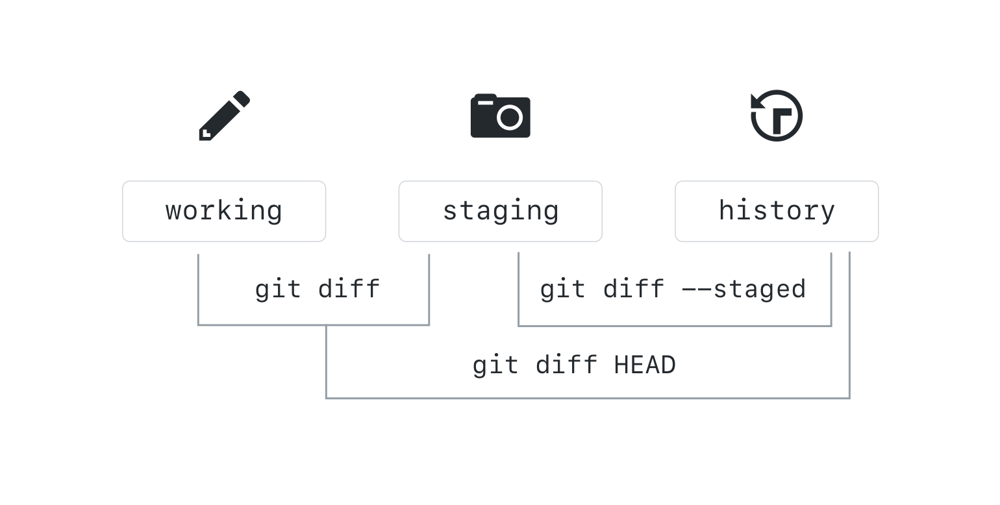

## Viewing Local Changes

Now that you have some files in the staging area and the working directory, let's explore how you can compare different points in your repository.

### Comparing Changes within the Repository

`git diff` allows you to see the difference between any two refs in the repository. The diagram below shows how you can compare the content of your working area, staging, and HEAD (or the most recent commit):



Let's try these commands on the repository:

```sh
git diff
git diff --staged
git diff HEAD
git diff --color-words
```

`git diff` will also allow you to compare between branches, commits, and tags by simply typing:

```sh
git diff <REF-1> <REF-2>
git diff main slow-down
git diff origin/main main
git diff 2710 b745
```

> Notice that, just like merges, diffs are directional. It is easiest to think of it as "diff back to `<REF-1>` starting at `<REF-2>`" or "see what is *not* in `<REF-1>` but *is* in `<REF-2>`".  The final example shows how to compare two commits based
on their commit hashes.  This exact command will not work for everyone since the commits in your own repository will have
different hashes.

There's a helpful alias for opening the remote directly from your command line. Check out the appendix if you'd like to know more!
