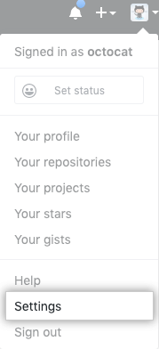
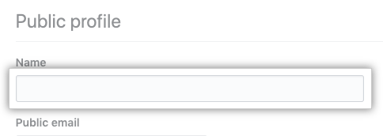

## Add your human-readable name

Adding your human-readable name to your profile enables people to find and @mention you without knowing your GitHub username. This can be especially helpful for repositories owned by an organization so other users can easily find you. It's important to note that your name may appear around GitHub where you contribute or are @mentioned. You can remove it at any time.

### What is an @mention?

An @mention is when you mention a GitHub username in an issue or pull request. The person @mentioned is notified and subscribed to future updates. You @mention by typing the `@` symbol plus the username. If you don't know their username, you might be able to find them by the first name or surname, if they've added it to their profile. You can also @mention teams. Read [Mentioning people and teams](https://docs.github.com/en/github/writing-on-github/basic-writing-and-formatting-syntax#mentioning-people-and-teams) for more information.

### Changing your profile name

1. In the upper-right corner of any page, click your profile picture dropdown, then click **Settings**.

  

1. Under "Name", type the name you want to be displayed on your profile

  

1. Click the "Update profile" button at the bottom of the page.
