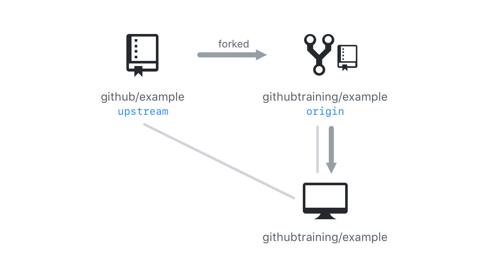
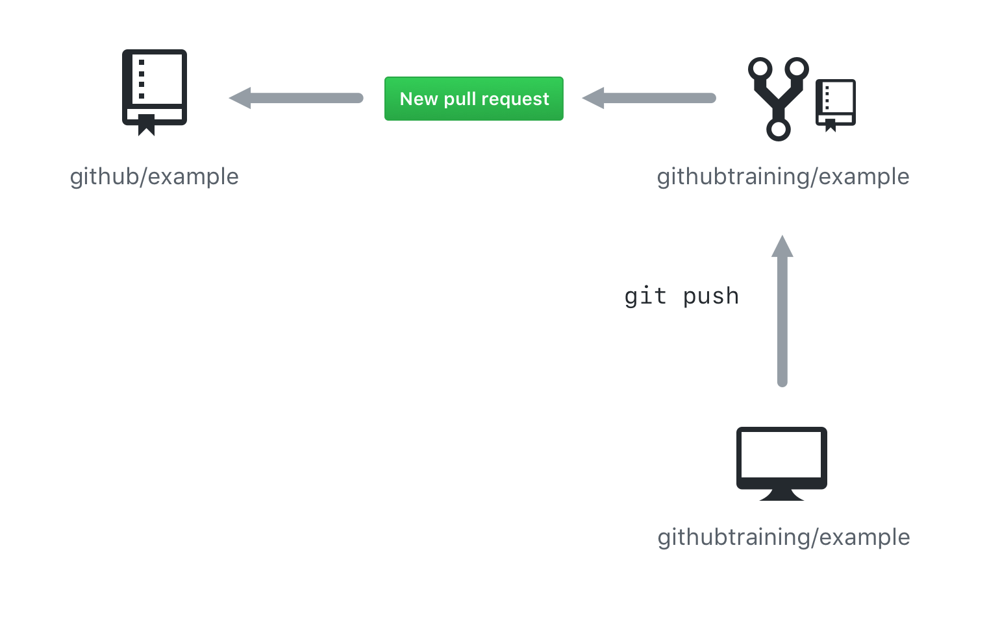

## Fork and Pull Workflow

Let's distinguish between a few vocabulary words in Git and discuss a common workflow that involves forking.

As in the picture below, all of our work generally starts from one parent repository. We call this the **parent** repository, but we can sometimes call it different things depending on _how_ we work with it.

For example, when we **clone** a repository by creating a local copy on our machine, we refer to that original remote repository as **origin**.

When we create branches, we can create them on our local **clone** _and_ on the remote **origin**.

Things start to get tricky when we start talking about forking. A **fork** is a remote copy of a repository with a different owner. When you have a new remote **fork**, you would refer to the parent remote as **upstream**.

If you cloned the fork, you would refer to your own fork as **origin**, and the parent as **upstream**.

When you want to return work back to the **origin** or **upstream** repositories, you would push back to **origin**, then open a pull request between the remote forks.

