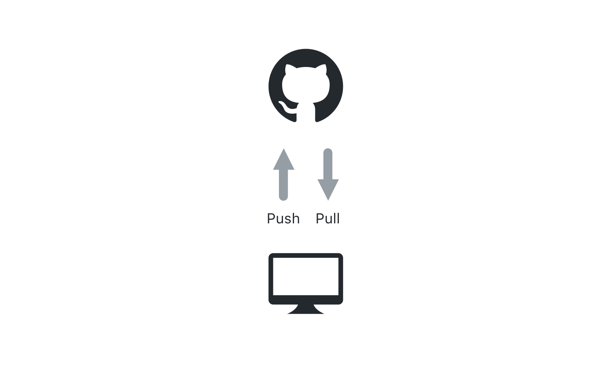

## コードについてのコラボレーション

ローカルでプロジェクトにいくつか変更を加えたため、コラボレーションのためにその変更をクラスの共有リポジトリにプッシュし戻す方法を学習しましょう。

### 変更をGitHubにプッシュ



今回このクラスでは、リモートはGitHub.comですが、あなたの勤務先のGitHub Enterpriseの内部インスタンスにすることもできます。

変更をGitHubにプッシュするには、次のコマンドを使います。

```sh
git push
```

> プッシュすると、GitHubのユーザ名とパスワードを入力するよう求められます。 Gitにこのコンピュータの資格情報を記憶させたい場合は、次の方法で資格情報をキャッシュすることができます。

- Windows: `git config --global credential.helper wincred`
- Mac: `git config --global credential.helper osxkeychain`

[include](07a_activity_create_pull_request.md ':include')

### Pull Requestについて知ろう

Pull Requestを作成したので、コラボレーションの中心的な要素となっているPull Requestの機能を、いくつか学習しましょう。

#### ![octicon-comment-discussion] Conversation タブ

Issueのディスカッションスレッドと同様に、Pull Requestには、リポジトリに対する変更に関する議論が含まれています。 このディスカッションはCoversationタブにあり、ブランチに対するすべてのコミットやPull Requestに適用された割り当て、ラベル、およびレビューの履歴も含まれています。

#### ![octicon-git-commit] Commits タブ

Commits viewには、ファイルを変更したユーザに関する詳細情報が含まれています。 それぞれのコミットIDをクリックすることで、その特定のコミットに適用された変更が表示されます。

#### ![octicon-diff] Files changed タブ

Files changed viewでは、ブランチで行われたすべての変更の累積的な結果を確認することができます。 これを`diff`（差分）と呼びます 。 私たちのdiffはまだあまり目を引くものではありませんが、変更を重ねると、diffはとてもカラフルになります。

### Pull Requestのコードレビュー

提案された変更に対するフィードバックを伝えるために、GitHubは3つのレベルのコメントを用意しています。

#### General Conversation

*Conversation*タブ内では、Pull Requestに関する一般的なコメントを行うことができます。

#### 行コメント

Files changed viewでは、青色の ![`+`][octicon-diff-added] アイコンを表示させるために、行の上にマウスを合わせます。 このアイコンをクリックすると、特定の行にコメントを入力できます。 この行レベルのコメントは、提案された変更についての追加情報を伝えるのに最適な方法です。 Conversation viewにも表示されます。

#### レビュー

行コメントを作成しているとき、 *Start a Review*を選択することもできます。 レビューを作成するときは、コメント、承認、または変更の要求など、一般的なメッセージとともに多くの行コメントをグループ化できます。 レビューは、保護されたブランチと組み合わせて使用すると、特別な力を発揮します。

### 実習：コードレビュー

コードの品質を保証するための最適な方法の１つは、ピアレビューをPull Requestの一部にすることです。 それでは、パートナーのコードをレビューしてみましょう。

1. *Pull Request*タブをクリックする。
2. *Author*ドロップダウンを使用して、パートナーのPull Requestを見つける。
3. *Files Changed*タブをクリックする。
4. ファイル内のいずれかの1行にカーソルを合わせると、青色の+が表示される。 その + をクリックして、行コメントを追加する。
5. 行にコメントを付けて、*Start review*をクリックする。
6. これらの手順を繰り返して、ファイルにコメントを２つ、３つ追加する。
7. 右上隅にある*Review*をクリックする。
8. *Approve* または *Request changes*を選択する。
9. レビューの一般的なコメントを入力する。
10. *Submit review*をクリックする。
11. 完了したレビューを確認するために、*Conversation* viewをクリックする。

[octicon-comment-discussion]:https://unpkg.com/octicons/build/svg/comment-discussion.svg

[octicon-diff]:https://unpkg.com/octicons/build/svg/diff.svg

[octicon-diff-added]: https://unpkg.com/octicons/build/svg/diff-added.svg

[octicon-git-commit]:https://unpkg.com/octicons/build/svg/git-commit.svg
