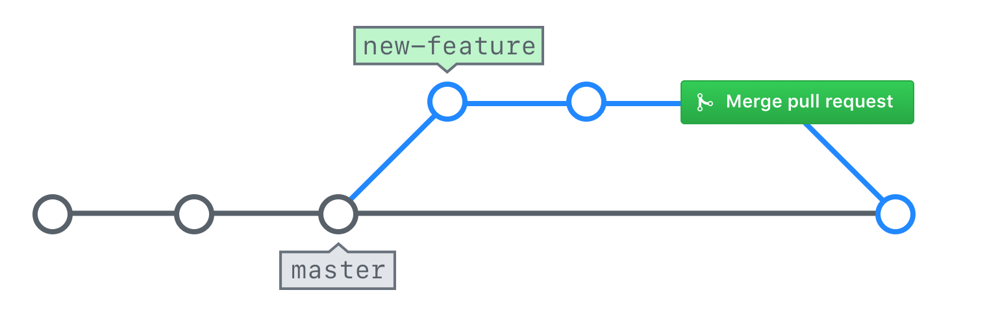

## Pull Requestのマージ

要求された変更を行ったので、あなたのPull Requestをマージする準備は完了しました。

### マージの説明

ブランチをマージするとき、あなたのフィーチャブランチからコンテンツと履歴が取り出され、` master `のブランチのコンテンツと履歴に追加されます。

多くのプロジェクトチームでは、誰がPull Requestをマージするべきか、ルールを定めています。

- マージの結果生じた問題を処理することになるため、Pull Requestの作成者が適任だと言う人もいます。
- 一貫性を確保するためには、プロジェクトチーム内にいるただ一名であるべきとの意見もあります。
- また、少なくとも１回のレビューが行われるよう、Pull Requestの作成者以外であるべきとの意見もあります。

この点は、チームの他のメンバーと話し合うべきです。

### 自分のPull Requestのマージ

Pull Requestをマージする方法を見てみましょう。

1. 自分のPull Requestに移動する。（ヒント：自分のPull Requestをリクエストをすばやく見つけるには、AuthorまたはAssigneeのドロップダウンを使用します）
2. *Conversation*をクリックする。
3. Pull Requestの一番下までスクロールし、*Merge pull request*をクリックする。
4. *Confirm merge*をクリックする。
5. *Delete branch*をクリックする。
6. *Issues*をクリックし、自分のIssueがクローズされたことを確認する。

> GitHubは、Pull Requestのマージする方法を３つ、用意しています。

- **Create a merge commit:**　標準的な再帰的マージを実行する従来のオプションです。 ２つのブランチがマージされた時点を示す、新しいコミットが追加されます。
- **Squash and merge:** このオプションは、ブランチ上のすべてのコミットを、１つのコミットに圧縮します。 コミットメッセージは、そのコミットの展開されたコミットメッセージに保存されますが、個々のコミットは失われます。
- **Rebase and merge:**　このオプションは、ちょうどコミットされたかのように、すべてのコミットを再生します。 これにより、GitHubは、fast forwardマージを実行できます。（そして、マージコミットの追加を避けることができます）

### ローカルリポジトリの更新

自分のPull Requestをマージしたとき、GitHub上のブランチを削除しましたが、リポジトリのローカルコピーは自動的に更新されません。 コマンドラインアプリケーションで、すべてを同期しましょう。

まず、GitHubで行った変更を、リポジトリのローカルコピーに取り込む必要があります。

1. デフォルトブランチに戻ることから始めましょう。`git switch master`
2. GitHubからすべての変更を取得する。` git pull `

` git pull `は、GitHubからのすべての変更を取得し、リモートからの変更を含めるために、現在位置するブランチを更新するための組み合わせコマンドです。 実行される２つの個別コマンドは、` git fetch `と` git merge ` です。

### 不要なブランチの削除

`git branch --all`を入力すると、リモートのブランチを削除していたとしても、リポジトリのローカルコピーに、ローカルブランチおよび読み取り専用のリモート追跡ブランチの両方としてリストされていることが分かるでしょう。 この余計なブランチを削除しましょう。

1. 自分のローカルブランチを確認　` git branch --all `
2. 削除しても問題ないブランチを確認　`git branch --merged`
3. そのローカルブランチを削除　`git branch -d <branch-name>`
4. リストを再度確認　`git branch --all`
5. ローカルブランチは削除されたが、リモート追跡ブランチは、まだ存在する。 よって、リモートトラッキングブランチを削除　`git pull --prune`

> `--merged` オプション `git branch` コマンドに追加することで、チェックアウトしたブランチと比較する際、独自の作業内容を有していないブランチを特定することができます。 この場合、masterにチェックアウトしたため、ブランチの削除前に、フィーチャブランチにおける変更のすべてが本番ブランチにマージされたことを確かめることができます。

リモート追跡ブランチの削除を、Pullする際のデフォルト処理として設定したい場合、次の設定オプションを使用します。`git config --global fetch.prune true`
