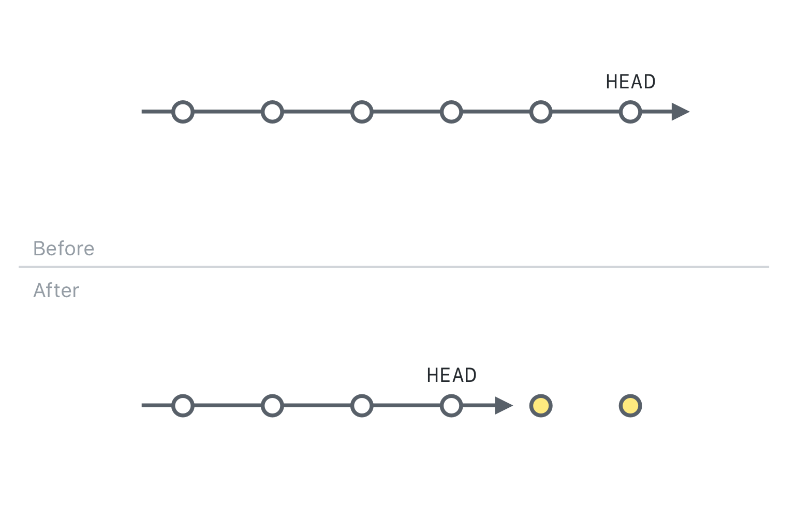
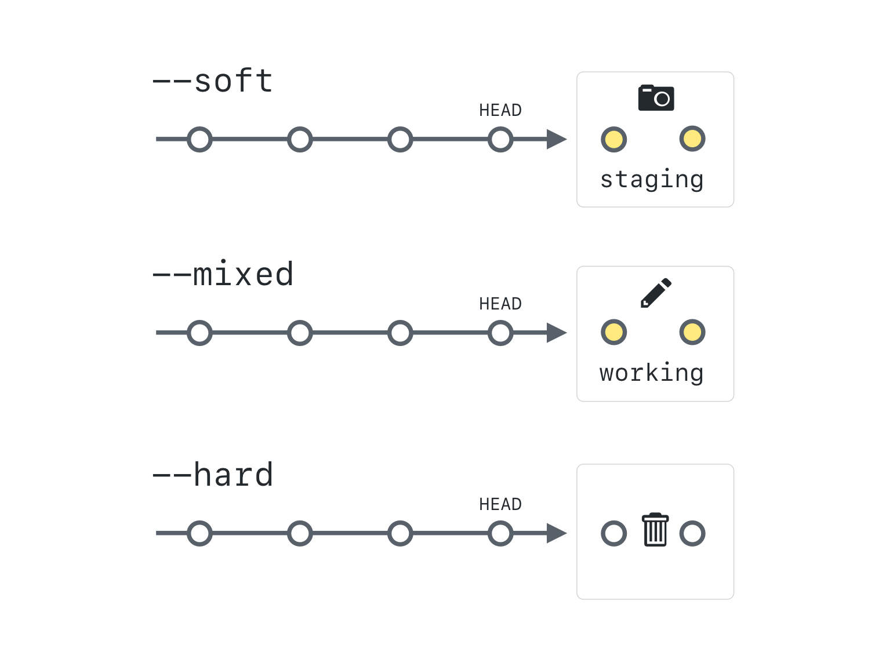

## Git Resetによる履歴の書き換え

履歴をさらに遡ったコミットを変更したい場合は、より強力なコマンドを使う必要があります。`git reset`

### Resetの仕組み

ブランチで作業をしていて、計画どおりに進まないと判断することがありますよね。 一部または全てのファイルを履歴の違う点の状態にリセットしたいとします。



ある時点で、プロジェクトには3つの違うスナップショットが存在します。 1番目のスナップショットは、最新のコミット（HEADとも言われます）です。 2番目は、ステージングエリア（インデックスとも言われます）。 3番目は、新規や削除、変更されたファイルを含むワーキングディレクトリです。

`git reset` のコマンドには、このスナップショットの一部もしくは、全てを変更できる、3つのモードがあります。

ブランチの本質が分かると、より理解しやすくなります。それぞれのブランチは最新コミットへのポインタまたは、参照です。 ブランチが常に最新のコミット指すために、コミットを追加したら現在チェックアウトされているブランチは「前進」します。

### Resetのモード



git resetの3つのモードは、`--soft`, `--mixed`, `--hard`です。 今回の例では、ワーキングディレクトリが「クリーン」だとします。つまり、コミットされていない変更がない、という状態です。

#### `--soft`

`git reset --soft <SHA>` は、現在のブランチを`<SHA>`に指すように移動します。 ただし、ワーキングディレクトリとステージングエリアは変更されません。 現在のブランチが指しているスナップショットがインデックスのスナップショットと異なるため、このコマンドは事実上、そのスナップショットの間の相違点をステージングします。 小さなコミットを大量にしていて、1つのコミットにまとめたいときに適したコマンドです。

#### `--mixed`

`git reset --mixed <SHA>` は、現在のブランチ*と*ステージングエリアを `<SHA>` のスナップショットの状態にします。 *これがデフォルトのモードです。* モードのフラグをつけないと、Gitはあなたが`--mixed`を意図していると判断します。 `--mixed` は、ワーキングディレクトリの変更を全て残したいが、その変更をコミットするかどうか、またはどのようにコミットするかを変更したいときに便利です。

#### `--hard`

`git reset --hard <SHA>` は、最も劇的なオプションです。 Gitは、現在のブランチやステージングエリア*と*ワーキングディレクトリのスナップショットを3つとも `<other-commit>` の状態にします。 これは危険です！ これまでは、ワーキングディレクトリがクリーンであるとしてきました。 クリーンでない場合、コミットされていない変更があったら、`git reset --hard` は、*その変更を全て削除します*。 クリーンなワーキングディレクトリの場合でも、前の変更を元に戻したいときのみに`--hard` を使ってください。

### Reset Soft

前に作成した練習用リポジトリを使って、`reset --soft` を行ってみましょう。

1. プロジェクトの履歴を確認します。 `git log --oneline --decorate`
1. `HEAD` の現在指している場所を特定します。
1. 履歴で2つ前のコミットに戻ります。`git reset --soft HEAD~2`
1. ブランチの先端（そして`HEAD`）が、2つ前のコミットを指していることを確認します。 `git log --oneline --decorate`
1. 最新の2つのコミットの変更は、ステージングエリアにあります。 `git status`
1. すべてのファイルはまだローカル環境にあることを確認します。 `ls`
1. 先ほど作成した追加のファイルを削除しましょう。 `git rm --cached file7.md`
1. ここで、この追加のファイル以外の変更を再コミットしましょう。 `git commit -m "re-add file 5 and 6"`

> この例では、チルダ記号は、現在の `HEAD` の場所の2つ前のコミットにリセットしたいとgitに伝えます。 コミットIDの数個の頭文字を使って、リセットする場所を特定することもできます。

### Reset Mixed

次は、reset のデフォルトモードを試します。`reset --mixed`

1. ここでも、最初にプロジェクトの履歴を確認します。 `git log --oneline`
1. 履歴で1つ前のコミットに戻ります。 `git reset HEAD~`
1. ブランチの先端がどこを指しているのかを確認します。 `git log --oneline --decorate`
1. 最新のコミットの変更は、ワーキングディレクトリに戻されています。 `git status`
1. すべてのファイルはまだローカル環境にあることを確認します。 `ls`
1. コミットする前に、ファイルをステージングエリアに移動する必要があります。 `git add file5.md file6.md`
1. ファイルを再コミットします。 `git commit -m "re-add file 5 and 6"`

> 本質的に同じコミット（ファイル5と6や、同じHEADとコミットメッセージを追加したコミット）をしたが、新たなコミットIDを取得したことに注意しましょう。 これが、すでにリモートにプッシュされているコミットにresetのコマンドを使ってはいけない理由です。

### Reset Hard

最後にhard resetを行ってみましょう。

1. 最初にプロジェクトの履歴を見ましょう。`git log --oneline`
2. README.mdのファイルしか存在しなかった時点にリセットします。`git reset --hard <SHA>`
3. コミットが全てなくなっていることを確認します。`git log --oneline`
4. ワーキングディレクトリがクリーンになったことを確認します。`git status`
5. リポジトリに README.md と file7.md しかないことを確認します。`ls`

> **注意：** `git reset --hard` は、ワーキングディレクトリやステージングエリア、履歴を書き換えます。 つまり、コミットされていない変更は完全に失われてしまいます。 本当に変更を破棄したい場合以外は、使わないようにしましょう。

### 「なくなった」とは、本当になくなった？

答えは、場合によります！

```sh
git reflog
```

reflogとは、HEADが指していた全ての場所の履歴です。 どのようにreflogを使えば、以前にコミットされた変更を復元できるのかを見ていきましょう。 まずは、reflogの制限を意識しておく必要があります。

- **reflogはあくまでローカルです**。リモートにプッシュされず、ローカルな履歴しか含まれていません。 つまり、他の人のコミットのreflogを見ることは不可能ですし、他の人があなたのreflogを見ることもできません。
- **reflogには時間制限があります**。デフォルトでは、到達可能なコミットは、90日間であればreflogで表示されますが、到達不可能なコミット（ブランチに繋がっていないコミット）は30日間しか表示されません。

> ときどき、コミットメッセージのことを考えずに、またはあなたの変更を整理する前にコミットとして作業を保存したいと思うことがあるかもしれません。その場合は、"save points" を作成するエイリアスを作成することができます。詳しくはエイリアスに関する appendix をご参照ください。
